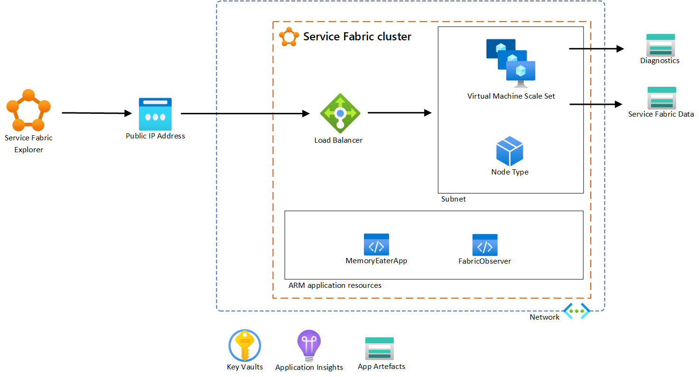
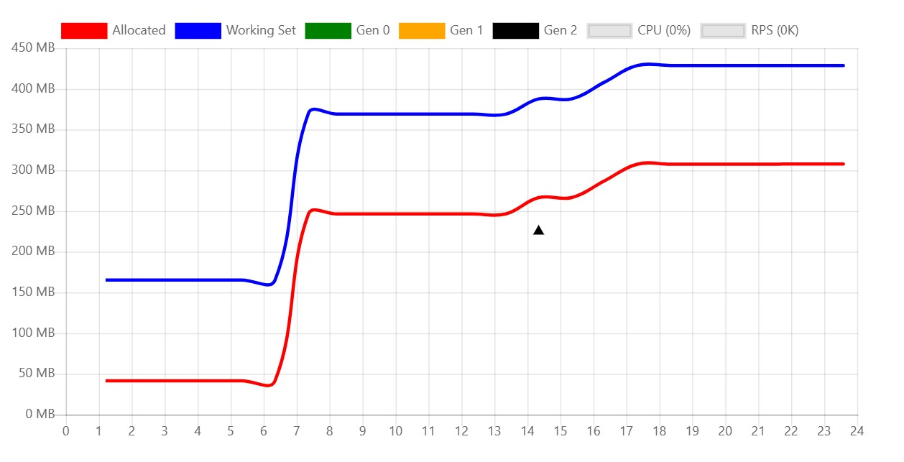
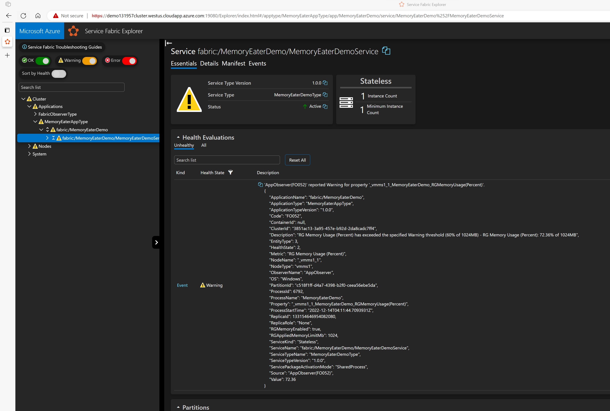
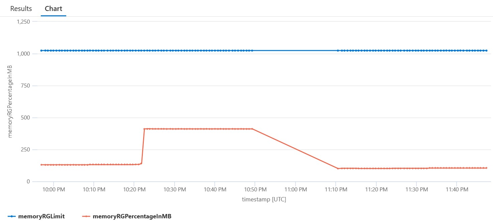

# Demo: Resource Governance Monitoring

## Objectives

FabricObserver 3.2.2 newest features adds notifications and telemetry for processes going over a percentage of the resource governance policy in Service Fabric.

## Demos 

- Alerting for when the memory usage goes over a certain percentage of the resource governance 
- Telemetry shows average memory usage of processes in relation to resource governance 
- OutOfMemoryException in the case where the memory usage reaches the limit of resource governance  

Video: [Resource Governance Monitoring on Azure Service Fabric - YouTube](https://www.youtube.com/watch?v=0fmphG1NCzg)

## Scenario configuration



## How to demo

1. Clone the repository with: git clone https://github.com/inputoutputcode/service-fabric-demos.git
1. Open the folder "resource-governance-monitoring/Scripts" in PowerShell.
1. Edit the file 01-Setup-AzureArtefacts.ps1 to provide your Azure subscription ID, RDP user account, and password for the certificate. You only need to edit the four parameters at the top of the file.
1. Execute: .\01-Setup-AzureArtefacts.ps1 (15 mins in avg).
1. Open the URL of SFX copied from PowerShell (example: https://demo130904cluster.westus.cloudapp.azure.com:19080/Explorer/index.html).
1. Open the URL to the dashboard copied from PowerShell (example: http://demo130904cluster.westus.cloudapp.azure.com:8081).
1. Execute the URL for the API in web browers a couple of times to see the memory increase in dashboard (example: http://demo130904cluster.westus.cloudapp.azure.com:8081/api/staticstrings/1000)
1. By reaching 600 MB of memory FabricObserver should generate a warning in SFX about reaching 60% of the resource governance policy.
1. By reaching 1000 MB of memory you should see a OutOfMemoryException.
1. Open the URL for Application Insights to query the telemetry data, with enough data you get average memory consumption. Queries below.

## Showcases

The dashboard in the custom app to see memory usage real time:



The data in SFX for the memory usage threshold warning. In this case the application MemoryEater eats more than 600MB:



The telemetry data in Azure Application Insights, showing the real memory usage in relation to resource governance policy: 



## Kusto query

Query to show memory usage against resource governance policy:
```
customEvents 
| where customDimensions['ApplicationTypeName'] == 'MemoryEaterAppType'
| where customDimensions['Metric'] == 'RG Memory Usage (Percent)'
| extend memoryRGLimit = toint(customDimensions['RGMemoryLimitMb'])
| extend memoryRGPercentageInMB = toint(todecimal(customMeasurements['RG Memory Usage (Percent)']) / 100 * memoryRGLimit)
| project timestamp, memoryRGPercentageInMB, memoryRGLimit
| render timechart
```

## Questions

Please create an issue on GitHub to ask questions, or comment on Youtube.
